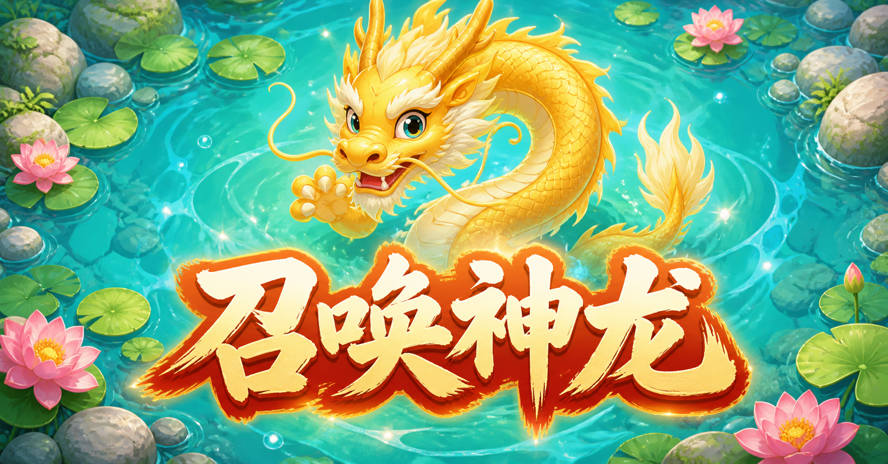

# 召唤神龙 Web MVP

<p align="center">
  
</p>

<p align="center">
  一款移动端优先、打开网页即可游玩的休闲吞噬进化小游戏。
</p>

> 从一只小蝌蚪开始，吞噬生物、自动合成、不断进化，最终召唤神龙！

## 项目简介

本项目是一个可直接运行在普通浏览器中的《召唤神龙》Web MVP。游戏不需要注册、后端服务或数据库，优先适配手机竖屏，适合通过链接快速分享给朋友试玩。

当前版本已完成从小蝌蚪到神龙的完整进化流程，包含自动前进、触摸转向、队伍跟随、三合一进化、野生生物生态、三档难度、胜负判定及完整音效。

## 功能特性

- 移动端优先，适配常见手机浏览器和微信内置浏览器
- 无需登录，无后端接口，无数据库
- 主角自动前进，通过隐形摇杆即时改变方向
- 完整队伍跟随，队伍任意位置都可触发吞噬或受击
- 三个同级生物自动合成下一级，支持连续进位
- 野生生物随机游动、碰边转向，不同等级之间会互相吞噬
- 简单、普通、困难三档难度，首页默认选择简单
- 镜头跟随主角，视野随玩家等级动态扩大
- 首次教程、暂停、横屏提示、重新开始与返回首页
- 背景音乐、吞噬、被吞噬、胜利和失败音效
- 右上角统一声音开关
- 程序化绘制生物与简单游动动画

## 游戏玩法

### 操作方式

1. 点击「开始游戏」后，主角会自动向前游动。
2. 手指按下的位置会成为隐形摇杆中心。
3. 按住并向任意方向拖动，主角会立即转向。
4. 松开手指后，主角会沿最后的方向继续自动前进。

### 吞噬与受击

- 队伍的吞噬能力按队伍中的最高等级判定。
- 队伍任意成员接触同级或更低级的野生生物时，可以将其吞噬。
- 接触比玩家最高等级更高的生物时，被接触的队伍位置会立即被移除。
- 主角被吞噬后，由队伍中剩余的最高级生物接替。
- 队伍没有受击无敌时间，持续接触高级生物会连续减员。

### 胜利与失败

- 胜利：合成神龙。
- 失败：队伍中的最后一个生物被吞噬。

## 进化路线

| 等级 | 生物 | 合成条件 |
| ---: | --- | --- |
| 1 | 小蝌蚪 | 初始形态 |
| 2 | 小青蛙 | 3 只小蝌蚪 |
| 3 | 小海龟 | 3 只小青蛙 |
| 4 | 小金鱼 | 3 只小海龟 |
| 5 | 锦鲤 | 3 只小金鱼 |
| 6 | 电鳗 | 3 条锦鲤 |
| 7 | 鲨鱼 | 3 条电鳗 |
| 8 | 鲸鱼 | 3 条鲨鱼 |
| 9 | 蛟龙 | 3 条鲸鱼 |
| 10 | 神龙 | 3 条蛟龙 |

## 技术栈

| 技术 | 项目中的用途 |
| --- | --- |
| React 19 | 构建首页、难度选择、教程、暂停与结算弹窗，并管理页面和游戏状态。 |
| TypeScript 5 | 为页面交互、游戏回调、生物数据和难度配置提供静态类型检查。 |
| Phaser 4 | 负责 Canvas 渲染、游戏主循环、生物移动、碰撞判定、镜头跟随、程序化绘制与粒子特效。 |
| Next.js 16 | 提供 React 应用结构、页面元数据、图片优化和客户端组件组织方式。 |
| Vinext | 通过 Vite 运行 Next.js 兼容应用，负责本地开发、生产构建及 Cloudflare Worker 兼容输出。 |
| Vite 8 | 提供快速开发服务、模块热更新和生产资源打包。 |
| HTMLAudioElement | 播放循环背景音乐和吞噬、受击、胜利、失败音效，并处理移动浏览器的音频解锁限制。 |
| CSS | 完成竖屏响应式布局、安全区适配、首页神龙漂浮动画和各类界面视觉效果。 |
| localStorage | 仅在本机保存「是否已看过首次教程」，不上传玩家数据。 |
| ESLint 9 | 统一代码规范并在提交前检查常见问题。 |

## 快速开始

### 环境要求

- Node.js `22.13.0` 或更高版本
- npm

### 安装与启动

```bash
git clone <your-repository-url>
cd SummonDragon
npm install
npm run dev
```

开发服务默认监听 `0.0.0.0:3000`：

- 电脑访问：`http://localhost:3000`
- 手机访问：`http://电脑的局域网IP:3000`

手机与电脑需要连接到同一个局域网。如果手机无法访问，请检查系统防火墙是否允许 Node.js 或 `3000` 端口的局域网连接。

### 生产构建

```bash
npm run build
npm run start
```

### 代码检查

```bash
npx tsc --noEmit
npm run lint
```

## npm 命令

| 命令 | 作用 |
| --- | --- |
| `npm run dev` | 启动开发服务并开放局域网访问 |
| `npm run build` | 构建生产版本 |
| `npm run start` | 启动生产服务 |
| `npm run lint` | 运行 ESLint 代码检查 |
| `npx tsc --noEmit` | 运行 TypeScript 类型检查 |

## 项目结构

```text
SummonDragon/
├─ app/                       # React 页面、弹窗、音频与移动端界面
├─ game/                      # Phaser 游戏循环、生物与难度配置
├─ public/
│  ├─ assets/                 # 池塘、神龙和音频素材
│  └─ og.png                  # GitHub / 社交分享预览图
├─ doc/
│  ├─ MVP方案.md             # 产品规则与 MVP 范围
│  └─ 开发与配置说明.md      # 调参、素材与部署说明
├─ .openai/hosting.json       # Sites 构建配置
├─ package.json
└─ README.md
```

## 难度与生物配置

主要可调数值集中在 [`game/config.ts`](./game/config.ts)：

- `CREATURES`：生物名称、颜色、尺寸、横向比例和视觉缩放。
- `DIFFICULTIES`：场上生物数量、移动速度、高低级生物权重和补充间隔。
- `MAP_WIDTH` / `MAP_HEIGHT`：池塘地图的逻辑尺寸。

更完整的配置说明请阅读 [开发与配置说明](./doc/开发与配置说明.md)。

## 音频说明

首页加载后会尝试自动播放背景音乐。由于现代浏览器的自动播放策略，音乐可能会在玩家首次点击或触摸页面后才开始播放。

音频文件位于 `public/assets/music/`：

| 文件 | 用途 |
| --- | --- |
| `backgroundmusic.mp3` | 循环背景音乐 |
| `eat.mp3` | 吞噬低级或同级生物 |
| `eated-sound.mp3` | 队伍成员被高级生物吞噬 |
| `winner.mp3` | 游戏胜利 |
| `failed.mp3` | 游戏失败 |

## 兼容性

项目以手机竖屏为主要使用方式，建议使用较新版本的浏览器：

- Android Chrome
- iPhone Safari
- 微信内置浏览器
- 桌面端 Chrome / Edge（竖屏画布）

当手机处于横屏时，游戏会自动暂停并提示旋转至竖屏。

## 文档

- [MVP 方案](./doc/MVP方案.md)
- [开发与配置说明](./doc/开发与配置说明.md)

## 当前范围与后续方向

当前为 MVP 版本，暂不包含登录、排行榜、成绩统计、广告、商城、当前局存档和键盘控制。

后续可考虑：

- 桌面端方向键控制
- 局内计时、成绩和本地最佳纪录
- 更丰富的动画、水下特效和角色素材
- 可选的音乐与音效独立开关


## 反馈

如果你发现问题或对玩法、难度、移动端适配有改进建议，欢迎通过 GitHub Issues 反馈。
